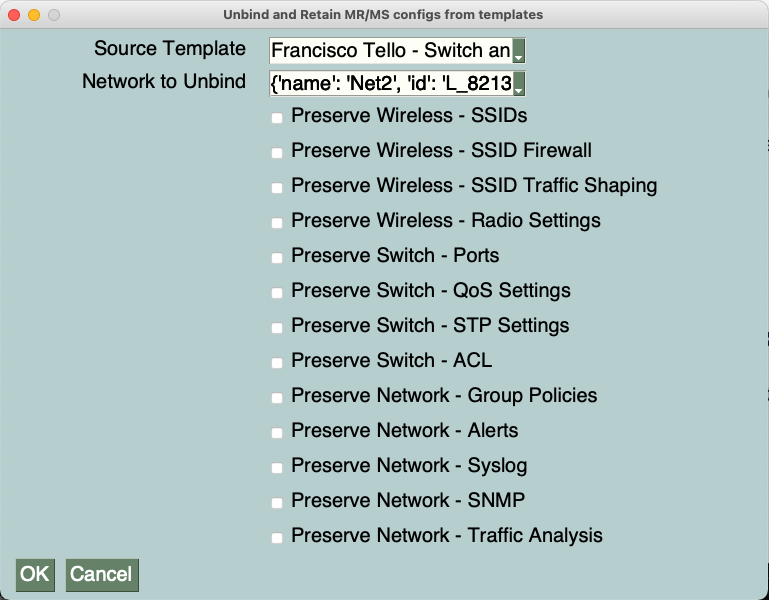

# meraki-unbind-mr-ms

This is a simple application that can unbind a MR/MS network from its template and retain various configs in the unbound network. It can be useful when:
1. You only want to retain specific configs in an unbound network vs. all of them
2. You run into errors using the Meraki Dashboard's native Unbind/Retain feature

**How to use:**
1. Install Python 3 on your workstation. You can find Python distributions and instructions here: https://www.python.org/downloads/
2. Run pip install -r requirements.txt to install the required Python packages for the project
3. Add your Meraki API key to the credentials.py file between the quotation marks. You can find instructions on how to generate an API key here: https://documentation.meraki.com/General_Administration/Other_Topics/Cisco_Meraki_Dashboard_API
4. OPTIONAL: Add your Organization ID to the credentials file to limit the scope of the script to just that organization.
5. Make sure this API key has write access to the organizations you're working on. You can add your account as Full Organization Admin to both organizations by following the instructions here: https://documentation.meraki.com/General_Administration/Managing_Dashboard_Access/Managing_Dashboard_Administrators_and_Permissions
6. Run the script with python main.py
7. Select your source template and then select the network you wish to unbind.
8. Check the boxes for preserving specific configurations in the unbound network.
9. Some configurations will request additional input from the user, like RADIUS settings for both SSIDs and Access Policies.
10. Some errors might occur during execution with certain features as explained in the caveats section.
11. If at the end of the script more than 0 errors were detected, you will be prompted with a list of the errors detected, and will be given the option of rolling back (automatic rebinding of the network to its template)

This is a sample image of the application being run. The names of the templates and networks in your environment will probably be different.

**Current capabilities:**
1. Preserve Wireless - SSIDs
2. Preserve Wireless - SSID Firewalls
3. Preserve Wireless - SSID Traffic Shaping
4. Preserve Switch - Ports (and any schedules and access policies)
5. Preserve Switch - QoS
6. Preserve Switch - STP
7. Preserve Switch - ACL
8. Preserve Network - Group Policies
9. Preserve Network - Alerts
10. Preserve Network - Traffic Analytics
11. Preserve Network - Syslog
12. Preserve Network - SNMP

**Caveats:**
1. If a network had access policies and/or Radio Profiles before being bound to a template, and the template it is being unbounded from has access policies or RF profiles with the same name, the script will fail to re-create those in the unbound network. However, it will still bind the APs/switch ports to them.
2. This script is only intended to work with MR+MS networks. Other Meraki product lines are not supported.
3. If a network only has MR, or only has MS products, make sure to only select the corresponding Preserve functions, or you will experience errors.
4. This script does not actually "retain" configs, but "recreates" them in the unbound network, and as such could introduce some downtime in your environment. It should be run during a maintenance window to avoid disruption of traffic.
5. It is highly recommended that you test this in a test network before running in a production network
